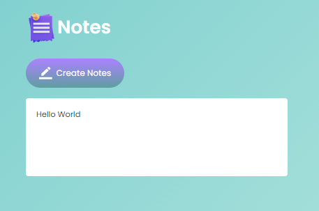
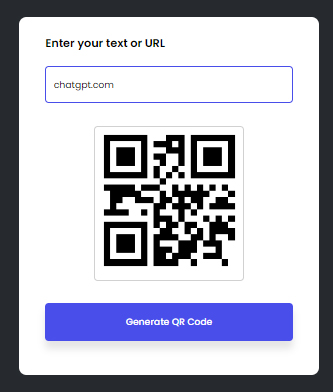
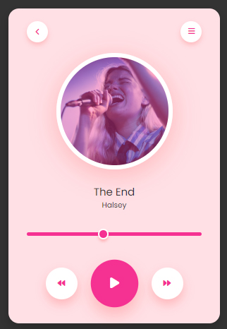

<!DOCTYPE html>
<html lang="en">
<head>
    <meta charset="UTF-8">
    <meta name="viewport" content="width=device-width, initial-scale=1.0">
</head>
<body>
    <h1>Basic JavaScript Projects Included in This Repo</h1>
  <ul>
     <li> <h2>01-Weather App</h2></li> 
     
     <li> <h2>02-To Do List App</h2></li> 
     
     <li> <h2>03-Quiz App</h2></li> 
     
     <li> <h2>04-Random Password</h2></li> 
     
     <li> <h2>05-Notes App</h2></li> 
     
     <li> <h2>06-Age Calculator</h2></li> 
     
     <li> <h2>07-Quote Of The Day</h2></li> 
     
     <li> <h2>08-QR Code Generate</h2></li> 
     
     <li><h2>09-Toast Notiication</h2></li> 
     
     <li> <h2>10-Music Player</h2></li> 
     

</body>
</html>
